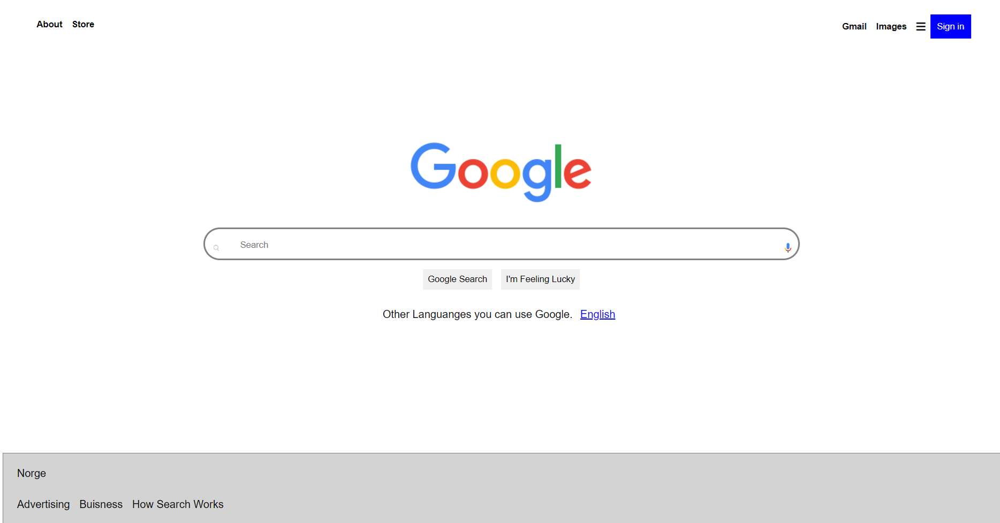

<h1 align="center">Google Home Page</h1>
<div align="center">
  <h3>
    <a href="https://simenpus.github.io/SigmaAlphaWolf/">
      Lenken til prosjektet
    </a>
  </h3>
</div>
<!-- TABLE OF CONTENTS -->

## Table of Contents

- [Overview](#overview)
- [Built With](#built-with)
- [Features](#features)
- [How to use](#how-to-use)
- [Contact](#contact)

<!-- OVERVIEW -->
## Overview
Det er et Google Home Page prosjekt. 

### Built With
- [HTML](https://www.w3schools.com/html/)
- [CSS](https://www.w3schools.com/css/default.asp)

## Features
I dette prosjektet brukte jeg både HTML og CSS, ikke Javascript. Dvs at dere ser bare et design, uten funksjonalitet. 

## How To Use
I mitt program fokuserte jeg på FlexBox. Hvis dere vil kan dere laste ned filene mine for å bruke.

```
HTML 
- https://css-tricks.com/snippets/css/a-guide-to-flexbox/
- https://css-tricks.com/snippets/css/a-guide-to-flexbox/
- https://css-tricks.com/snippets/css/a-guide-to-flexbox/
CSS 
- https://css-tricks.com/snippets/css/a-guide-to-flexbox/
- https://css-tricks.com/snippets/css/a-guide-to-flexbox/
- https://css-tricks.com/snippets/css/a-guide-to-flexbox/

```

## Contact
- GitHub [Røyken VGS](https://github.com/roykenvgs)
- Epost [Røyken VGS](mailto:test@gmail.com)


## Happy coding!

## Forventet resultat
